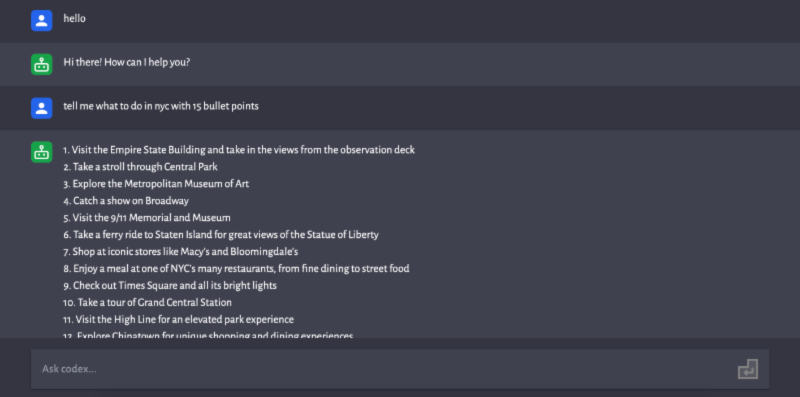

# My GPT

An AI chatbot app which leverages the latest in natural language processing technology to provide you with intelligent and personalized responses.
The app's serverless backend is built using AWS Amplify, API Gateway, and Lambda. While a serverless infrastructure may not be the most ideal approach in terms of cost as the number of users increases, I still wanted to explore this technology and its capabilities.

## Demo

## Stacks
- React JS
- Tailwind CSS
- OpenAI API
- AWS Amplfy with API Gateway and Lambda
- Figma (for assets)

## What I learned from this project
- Using Vite React for the first time and discovering the phenomenal HMR feature.
- How to set up a serverless backend with Amplify CLI.
- Understanding how API Gateway and Lambda function integrate.
- Debugging Lambda functions with CloudWatch Log.
- Deploying the React app with an Amplify backend on Amplify and the required steps to do so.